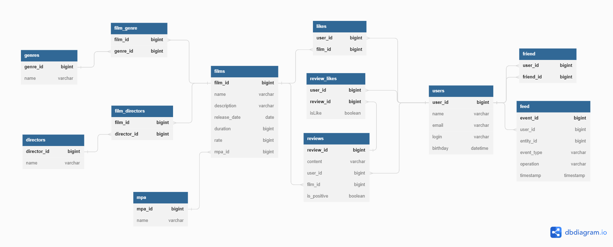

# java-filmorate
Template repository for Filmorate project.

## ER-Diagram:

### SQL queries examples

1) Get Film By Id

`   SELECT *, mpa.NAME as mpa_name FROM films
    INNER JOIN mpa ON mpa.MPA_ID = films.MPA_ID WHERE FILM_ID = ?`

2) Get Recommendations

`   SELECT user_id, count(*) as cnt FROM likes 
    WHERE film_id IN (SELECT film_id  FROM films WHERE film_id IN (
        SELECT film_id FROM likes WHERE user_id = ?))
        AND user_id != ? 
    GROUP BY user_id
    ORDER BY cnt DESC
    LIMIT 1`

3) Get All Event Feed

`    SELECT * FROM feed`

## Functionality implemented:

**F1 - Event Feed**

    F1-1 - Get All Events
    F1-2 - Add Like To Event
    F1-3 - Remove Like From Event
    F1-4 - Add Friend To Event
    F1-5 - Remove Friend From Event
    F1-6 - Add Review To Event
    F1-7 - Remove Review From Event
    F1-8 - Update Review Event

**F2 - Films**

    F2-1 - Get Film By ID
    F2-2 - Create Film
    F2-3 - Delete Film
    F2-4 - Update Film
    F2-5 - Find All Films
    F2-6 - Search Film By Substring
    F2-7 - Get Films By Director
    F2-8 - Get Common Films

**F3 - Film Likes**

    F3-1 - Add Like To Film
    F3-2 - Remove Like From Film
    F3-3 - Find Popular Films By Genre OR/AND Year
    F3-4 - Get Recommendations

**F4 - Directors**

    F4-1 - Create Director
    F4-2 - Update Director
    F4-3 - Get Director By Id
    F4-4 - Get All Directors
    F4-5 - Delete Director

**F5 - Users**

    F5-1 - Create Users
    F5-2 - Find User By ID
    F5-3 - Find All Users
    F5-4 - Update Users
    F5-5 - Delete User

**F6 - Genres**

    F6-1 - Get Genre By Id
    F6-2 - Find All Genres

**F7 - Friends**

    F7-1 - Get Friends For User
    F7-2 - Get Common Friends
    F7-3 - Add Friend To User
    F7-4 - Delete Friend From User

**F8 - Review**

    F8-1 - Create Review
    F8-2 - Update Review
    F8-3 - Delete Review
    F8-4 - Get All Reviews
    F8-5 - Get Review By Id
    F8-6 - Get Reviews By Film

**F9 - Review Likes**

    F9-1 - Add Like To Review
    F9-2 - Add Dislike To Review
    F9-3 - Remove Like Or Dislike From Review

**F10 - MPA**

    F10-1 - Find Mpa By ID
    F10-2 - Find All Mpa
